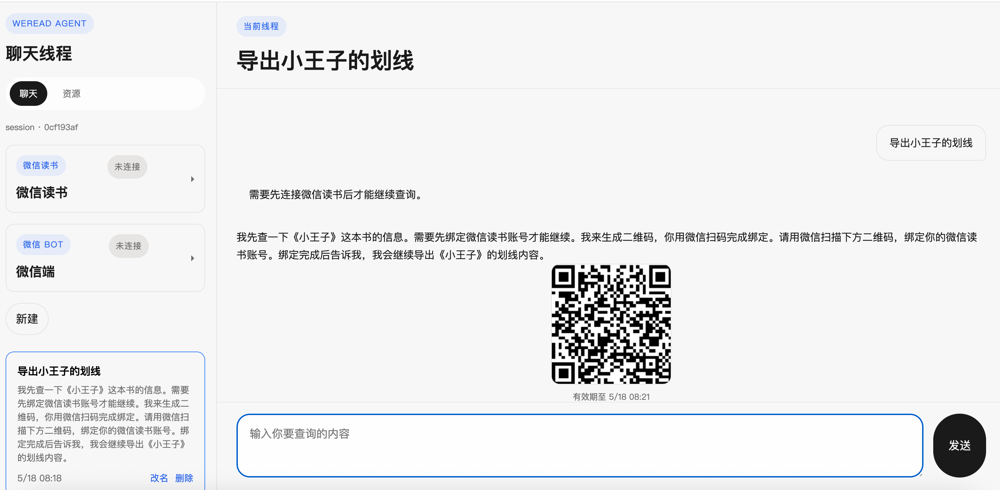
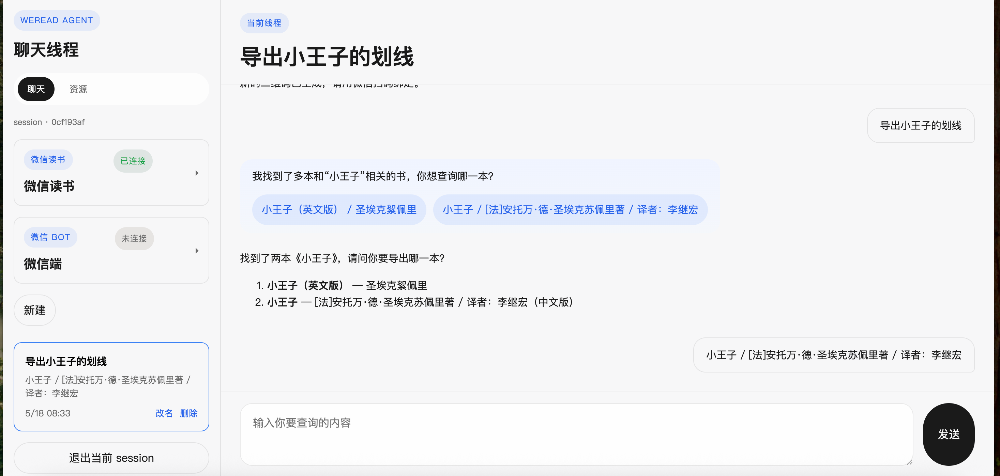
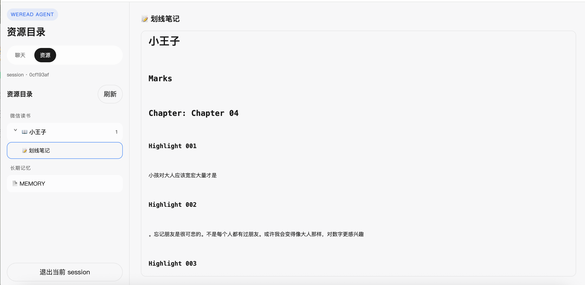
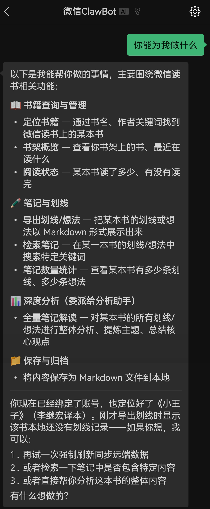

# WeRead Agent

微信读书 AI 助手 —— 支持自然语言检索书籍笔记、主题分析与长期阅读记忆管理，并接入 Web / QQ / 微信多端对话。

## 支持功能
- 扫码登录，用于获取个人微信读书相关数据
    <p align="center">
     
    <p>
- 用自然语言让助手导出笔记
  - 输入自然语言
    <p align="center">
      
    <p>
  - 笔记展示与归纳
    <p>
     
    <p>
- 微信端对话
    <p align="center">
     
    <p>

## 快速开始（Docker）

```bash
git clone https://github.com/WenWen610/WeRead-Agent.git
cd weread-agent
cp .env.example .env.development
# 编辑 .env.development，至少填写：
#   JWT_SECRET_KEY=<随机生成的密钥>
#   LLM_PROVIDER=openai  （或 deepseek）
#   OPENAI_API_KEY=<你的 API key>  （或 DEEPSEEK_API_KEY）
make docker-compose-up ENV=development
```

一行命令启动完整栈：


| 服务               | 地址                                                       |
| ---------------- | -------------------------------------------------------- |
| 前端 UI            | [http://localhost:5173](http://localhost:5173)           |
| 后端 API           | [http://localhost:8000](http://localhost:8000)           |
| API 文档 (Swagger) | [http://localhost:8000/docs](http://localhost:8000/docs) |


停止：`make docker-compose-down ENV=development`

### 基本使用流程

1. 在前端注册 / 登录
2. 创建或选择一个 chat thread
3. 绑定微信读书：侧边栏或对话中触发二维码扫码登录
4. 询问和书架、划线、想法相关的问题
5. 让助手展示或保存某本书的 Markdown 分析材料
6. 继续对话，后台 Markdown memory 会在满足条件时异步抽取

---

## Embedding 配置

向量语义搜索默认关闭 —— FTS5 中文分词搜索已能满足大部分检索需求。

如需启用语义搜索，有以下三种方式：


| 方式           | 配置                                                                                                                                                         | 费用                               |
| ------------ | ---------------------------------------------------------------------------------------------------------------------------------------------------------- | -------------------------------- |
| 不开（默认）       | `NOTE_EMBEDDING_ENABLED=false`                                                                                                                             | 免费                               |
| OpenAI API   | `NOTE_EMBEDDING_ENABLED=true` + 配 `OPENAI_API_KEY`，provider 设为 `openai`                                                                                    | 按量付费（text-embedding-3-small 极便宜） |
| DeepSeek API | `NOTE_EMBEDDING_ENABLED=true` + `NOTE_EMBEDDING_PROVIDER=openai_compatible` + `NOTE_EMBEDDING_BASE_URL=https://api.deepseek.com/v1` + 配 `DEEPSEEK_API_KEY` | 按量付费                             |
| 本地模型         | 详见下方示例                                                                                                                                                     | 免费（需 Docker Desktop）             |


```bash
# 先启动嵌入模型
docker model run ai/qwen3-embedding:4B --port 12434

# .env.development:
NOTE_EMBEDDING_ENABLED=true
NOTE_EMBEDDING_PROVIDER=docker_model_runner
NOTE_EMBEDDING_MODEL=ai/qwen3-embedding:4B
NOTE_EMBEDDING_API_KEY=not-needed
NOTE_EMBEDDING_BASE_URL=http://localhost:12434/engines/v1
NOTE_EMBEDDING_DIMENSIONS=2560
```

详见 `.env.example` 中 `NOTE_EMBEDDING_*` 注释。

---

## 快速开始（手动安装）

开发者或不想用 Docker 的场景：

```bash
# 1. 安装依赖
uv sync

# 2. 配置
cp .env.example .env.development
# 编辑 .env.development，至少填写 JWT_SECRET_KEY、LLM_PROVIDER、API key

# 3. 启动后端
make dev
# → http://localhost:8000

# 4. 启动前端（另一个终端）
cd frontend
npm install
npm run dev
# → http://localhost:5173
```

---

## 架构设计

### DeepAgent 运行时

基于 [deepagents](https://github.com/langchain-ai/deepagents) 构建 agent 运行时，利用其内置能力：

- **Skills**：从文件系统加载 Markdown 技能文件，为 agent 注入特定领域的任务流程指引。扩展行为只需在 `skills/` 目录下添加 `.md` 文件。
- **主 Agent + 子 Agent**：主 agent 负责用户对话，重型分析任务（如全书画线分析）委托给子 agent（`weread_notes_analyst`），各自保持干净的上下文窗口，避免上下文污染。
- **原生文件工具**：agent 内置 `write_file` / `read_file` / `ls` / `glob` / `grep` 等工具，可直接读写本地 Markdown 文件。
- **内置压缩**：上下文过长时自动触发 summarization 压缩，与 Markdown 长期记忆形成双层记忆体系。

Middleware 管线在 agent 的 `before_model` / `on_tool_end` / `after_agent` 生命周期节点中注入逻辑：记忆检索、微信读书状态管理、能力检查、澄清拦截等。

### Markdown 长期记忆

记忆系统借鉴了 [QwenPaw](https://github.com/nicepkg/qwenpaw) 和 [openclaw](https://github.com/nicepkg/openclaw) 的设计理念 —— Markdown 文件是唯一真相源（source of truth），人可直接阅读和编辑，SQLite 仅做 FTS/向量索引和后台任务队列。

```
{MARKDOWN_MEMORY_ROOT}/user_{id}/
├── MEMORY.md              # 跨日期的稳定长期记忆
├── memory/
│   ├── 2026-05-18.md      # daily note，跨线程汇总
│   └── ...
├── backup/                # dream consolidation 前的备份
└── .index/                # 索引元数据缓存
```

**后台记忆触发条件**：

Agent 每轮对话结束后，middleware 在 `aafter_agent` 回调中检查以下三个条件（任一满足即入队）：

1. **间隔触发**：当前线程排除 filler 消息后，新增的 user turn 数量 >= `MARKDOWN_MEMORY_AUTO_INTERVAL`（默认 5 轮）
2. **显式信号触发**：用户消息中出现 "记住 / 记一下 / remember" 等关键词
3. **上下文压缩触发**：DeepAgent 触发 summarization 压缩时，会在 state 中写入 `_summarization_event: {cutoff_index: N}` 信号，middleware 检测到此信号后，将 cursor 到 cutoff 之间的对话窗口打包入队，确保压缩前的可沉淀内容不丢失

**后台异步管道**：

```
Middleware (aafter_agent)
  → asyncio.create_task() 异步入队，不阻塞主对话流
  → MarkdownMemoryJobStore (SQLite)  持久化 job，含去重锁 + per-thread cursor
  → asyncio.Queue → _task_worker_loop  单消费者串行處理
    ├── auto_memory: make_auto_memory_agent() → ReAct agent 读对话 transcript → append daily note
    └── dream: make_dream_agent() → 读 MEMORY.md + 近期 daily notes → 重写 MEMORY.md
  → APScheduler cron: 每日 3AM 遍历所有用户 workspace 投递 dream 任务
  → 启动时 recover_auto_memory_jobs: 重置遗留 running 任务为 pending
```

cursor 是 per-thread 的（记录每个线程已处理到的消息位置），daily note 是跨线程的。只有后台 job 确认写入、确认重复跳过、或返回 `[SILENT]` 时，cursor 才会推进。

### 本地优先架构

所有数据存储在 `data/local_knowledge/` 下（可配置 `LOCAL_KNOWLEDGE_DIR`）：

- 应用数据库 (SQLite)
- LangGraph checkpoints + DeepAgent store (SQLite)
- Markdown memory 文件和索引 (SQLite FTS + 可选 sqlite-vec 向量)
- 用户保存的 Markdown 文档

零外部服务依赖。备份 / 迁移只需拷贝数据目录。

---

## 核心功能

### 阅读助手

- 用自然语言提到书名，助手自动定位书架中的书
- 检索某本书的划线、想法或两者组合（优先检索你的笔记而非全文）
- 生成 Markdown 分析文档，前端 artifact 面板直接展示
- 需要绑定微信读书时触发 Playwright 二维码登录流程

### 微信读书绑定

- 侧边栏或对话中触发浏览器扫码登录
- Cookie 加密存储（`WEREAD_CREDENTIAL_SECRET`），支持 reauth 检测和提醒
- 书架同步、书籍封面/元数据、阅读进度等缓存本地

### 微信读书能力：为什么是 Tool 而非 MCP

当前微信读书能力以 agent tool 形式内嵌在项目中，而非独立 MCP server。核心原因是 DeepAgent 的 middleware 层需要在 tool 调用前后拦截和注入状态：

- **WeReadStateMiddleware** 在 `on_tool_end` 拦截 `resolve_weread_book` 的返回结果，提取 book_id 注入 `current_book` 状态，后续 LLM 调用其他 tool 时自动获得上下文
- **CapabilityMiddleware** 在 WeRead tool 返回中检测 `binding_required` / `reauth_required` 错误，标记 `pending_capability_requirement` 状态，让 LLM 知道要调 `connect_weread`

如果拆成 MCP，这些拦截点会丢失，middleware 管线失效。后续如果多个 agent runtime 需要共享同一套 WeRead 能力，再抽成共享服务 + 协议层更合理。

### 微信 / QQ 通道

- WeChat channel 可用，支持二维码绑定，外部消息接入同一 agent bridge（通信机制参考 [nanobot](https://github.com/HKUDS/nanobot)）
- QQ channel 需配置 bot app id/secret，尚未完整验证
- 开源使用时可以先忽略，只用 Web 前端

---

## 技术栈


| 层        | 技术                                          |
| -------- | ------------------------------------------- |
| 后端框架     | FastAPI, SQLModel                           |
| Agent 框架 | LangGraph, DeepAgents, LangChain            |
| 存储       | SQLite（默认），可选 PostgreSQL                    |
| 记忆       | Markdown 文件 + SQLite FTS + 可选 sqlite-vec 向量 |
| 认证       | JWT + session token                         |
| 前端       | React 19, Vite, TypeScript                  |
| 可观测      | structlog，可选 LangSmith tracing              |
| 包管理      | uv (Python 3.13+)                           |


---

## 项目结构

```text
app/
  api/v1/                       # FastAPI 路由层
    chatbot.py                  # 主聊天入口 + SSE streaming
    weread.py                   # 微信读书绑定和文档 API
    memory.py                   # Markdown memory API
    auth.py                     # 注册/登录/session
    saved_content.py            # 本地 Markdown 文档读写
    channels.py                 # WeChat/QQ channel
  runtimes/deep_agent/          # DeepAgent 运行时（唯一活跃 runtime）
    agent.py                    # Agent 组装入口
    client.py                   # chat / stream / history API
    tools.py                    # 主 agent 工具定义
    subagents.py                # 子 agent 定义
    memory_subagents.py         # 后台 memory / dream agent
    middleware/                  # 6 个 middleware（记忆、状态、能力检查等）
    skills.py                   # Skill 路径解析
    prompts.py                  # System prompt 定义
    backends.py                 # CompositeBackend（State + Filesystem）
  features/
    weread/                     # 微信读书业务层
    markdown_memory/            # Markdown 长期记忆
    chat/                       # 聊天线程存储
    auth/                       # 用户存储
  infrastructure/               # config, DB, LLM, logging, metrics, limiter
  models/                       # SQLModel ORM
  schemas/                      # Pydantic schemas
frontend/                       # React + Vite 前端
skills/                         # DeepAgent skill 文件（Markdown）
tests/                          # 单元和集成测试
evals/                          # 评估框架（数据集需自行准备）
prometheus/, grafana/           # 监控配置
```

---

## 测试和评估

测试使用脱敏样例数据（虚构的书籍和划线文本），不包含真实用户数据。

```bash
uv sync --group test
uv run pytest
uv run pytest -m "not slow"   # 跳过耗时测试
```

当前已有 Markdown memory、WeRead、本地检索、DeepAgent middleware 等模块的单元测试。CI 仍在建设中。

`evals/` 目录保留评估框架代码（evaluators、LangSmith 集成、metrics prompts），数据集需自行准备。

---

## 常用命令

```bash
# Docker（推荐）
make docker-compose-up ENV=development      # 启动完整栈
make docker-compose-down ENV=development    # 停止
make docker-compose-logs ENV=development    # 查看日志

# 本地开发
make dev                                    # 启动后端（热重载）
uv run pytest                               # 运行测试
make lint / make format                     # 代码检查 / 格式化
```

---

## 配置说明

关键环境变量见 `.env.example`。最重要的几项：


| 变量                                    | 说明                                                           |
| ------------------------------------- | ------------------------------------------------------------ |
| `LLM_PROVIDER`                        | `openai` 或 `deepseek`                                        |
| `OPENAI_API_KEY` / `DEEPSEEK_API_KEY` | 聊天模型 API key                                                 |
| `DEFAULT_LLM_MODEL`                   | 模型名称（如 `gpt-4o-mini` / `deepseek-chat`）                      |
| `JWT_SECRET_KEY`                      | 本地认证签名密钥，部署时务必更换                                             |
| `NOTE_EMBEDDING_ENABLED`              | 是否启用向量语义搜索（默认 `false`）                                       |
| `NOTE_EMBEDDING_PROVIDER`             | 嵌入模型 provider（`openai` / `deepseek` / `docker_model_runner`） |
| `MARKDOWN_MEMORY_ENABLED`             | 是否启用 Markdown 长期记忆                                           |
| `LOCAL_KNOWLEDGE_DIR`                 | 本地数据根目录                                                      |
| `WEREAD_*`                            | 微信读书二维码登录相关配置                                                |


---

## Roadmap

以下功能正在计划中：

- **安装体验改进**：探索一键安装脚本、桌面应用壳（Electron/Tauri），降低非技术用户的门槛
- **微信端适配**：完善 WeChat channel 的登录和使用体验
- **Web UI 完善**：前端从开发工具形态向产品形态演进
- **Prometheus + Grafana 监控面板**：基础设施已搭好，LLM 指标埋点待接入
- **CI / 质量门禁**：lint、test、前端构建自动化流水线
- **生产部署指南**：独立部署文档，覆盖 HTTPS、数据备份、密钥管理等
- **Embedding 模型文档**：本地嵌入模型的完整部署说明

欢迎提 Issue 和 PR。

---

## 致谢

本项目受益于以下开源项目：

- [fastapi-langgraph-agent-production-ready-template](https://github.com/wassim249/fastapi-langgraph-agent-production-ready-template) — FastAPI + LangGraph 项目脚手架
- [mcp-server-weread](https://github.com/freestylefly/mcp-server-weread) — 微信读书 API 调用链的实现参考
- [QwenPaw](https://github.com/nicepkg/qwenpaw) — Markdown 长期记忆的设计启发（人可读、文件即真相源）
- [openclaw](https://github.com/nicepkg/openclaw) — 本地优先 AI 助手的整体范式和运行时设计参考
- [nanobot](https://github.com/HKUDS/nanobot) — WeChat / QQ 多渠道通信机制的设计参考
- [deepagents](https://github.com/langchain-ai/deepagents) — DeepAgent 框架和核心 harness 能力

## License

见 [LICENSE](LICENSE)